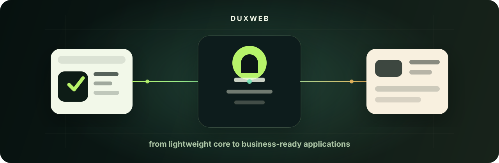

  

<h1 align="center">DuxWeb</h1>

  <strong>An independent open-source organization building practical frameworks and tools for business software.</strong>

  <a href="https://github.com/duxweb/runa">Runa</a>
  ·
  <a href="https://duxweb.github.io/runa/">Runa Docs</a>
  ·
  <a href="https://github.com/duxweb/oro">Oro</a>
  ·
  <a href="https://github.com/duxweb/codux">Codux</a>

---

## About DuxWeb

DuxWeb is a small, independent open-source organization without sponsorship at the moment. Most of the work is currently designed, developed and maintained by one person, with help from users, feedback and contributors when available.

The goal is simple: build frameworks and developer tools that are useful in real business projects, not just demos. Most of these projects come from repeated problems we met while building real products, then were cleaned up, generalized and released as open source. The projects here cover backend frameworks, admin systems, frontend tooling, documentation themes and native developer tools.

We care about:

- **Practical architecture** — small cores, clear modules and features that match real application work
- **Business development** — routing, admin panels, forms, OpenAPI, database, queues, permissions and operational tooling
- **Long-term maintainability** — explicit naming, clear boundaries and documentation that a new developer can follow
- **Independent open source** — useful tools first, commercial packaging later if the project becomes sustainable

## Contact

If you have a project that needs custom development, framework integration, business system architecture or technical consulting, you can contact me by email. Sponsorship and long-term collaboration are also welcome.

- Email: <admin@dux.plus>

## Recommended projects

<table width="100%">
  <tr>
    <th align="left" width="22%">Area</th>
    <th align="left" width="24%">Project</th>
    <th align="left">Focus</th>
  </tr>
  <tr>
    <td rowspan="2"><strong>Go ecosystem</strong></td>
    <td><a href="https://github.com/duxweb/runa"><strong>Runa</strong></a></td>
    <td>Go Web framework for business applications, built around a lightweight core and installable capabilities</td>
  </tr>
  <tr>
    <td><a href="https://github.com/duxweb/oro"><strong>Oro</strong></a></td>
    <td>Generic-first ORM for Go</td>
  </tr>
  <tr>
    <td rowspan="2"><strong>PHP ecosystem</strong></td>
    <td><a href="https://github.com/duxweb/dux-ai"><strong>dux-ai</strong></a></td>
    <td>PHP 8 based AI application system</td>
  </tr>
  <tr>
    <td><a href="https://github.com/duxweb/dux-lite"><strong>dux-lite</strong></a></td>
    <td>Lightweight PHP framework based on Slim</td>
  </tr>
  <tr>
    <td rowspan="2"><strong>Frontend and docs</strong></td>
    <td><a href="https://github.com/duxweb/dvha"><strong>dvha</strong></a></td>
    <td>Vue 3 headless admin framework</td>
  </tr>
  <tr>
    <td><a href="https://github.com/duxweb/vela"><strong>vela</strong></a></td>
    <td>Astro documentation framework used by Dux projects</td>
  </tr>
  <tr>
    <td rowspan="2"><strong>Desktop tools</strong></td>
    <td><a href="https://github.com/duxweb/codux"><strong>codux</strong></a></td>
    <td>Native connected terminal for AI agent development</td>
  </tr>
  <tr>
    <td><a href="https://github.com/duxweb/codux-flutter"><strong>codux-flutter</strong></a></td>
    <td>Mobile companion for the Codux terminal workspace</td>
  </tr>
</table>

## 中文

DuxWeb 是一个独立开源组织，目前还没有任何赞助，主要由一人持续开发和维护，也会根据用户反馈与社区贡献不断调整方向。

我们关注的不是只适合演示的项目，而是真正能落到业务开发里的框架和工具。这里的大多数软件都来自真实项目经验：先在实际业务里遇到问题，再把反复出现的方案整理、抽象并开源出来。当前项目覆盖 Go、PHP、前端、文档主题、桌面软件和 AI 开发工具等方向。

如果你正在寻找可以长期演进的业务开发框架，可以先看 [Runa](https://github.com/duxweb/runa)、[Oro](https://github.com/duxweb/oro)、[dux-ai](https://github.com/duxweb/dux-ai)、[dux-lite](https://github.com/duxweb/dux-lite)、[dvha](https://github.com/duxweb/dvha)、[vela](https://github.com/duxweb/vela) 和 [Codux](https://github.com/duxweb/codux)。

如果你有项目开发、框架集成、业务系统架构或技术咨询需求，也可以通过邮件联系我：<admin@dux.plus>。欢迎赞助、合作或长期项目支持。
